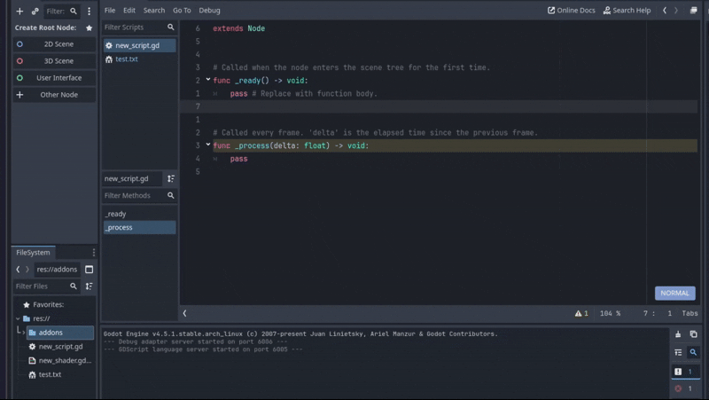
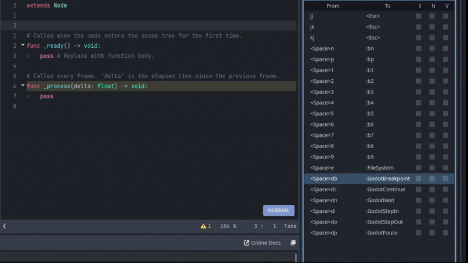
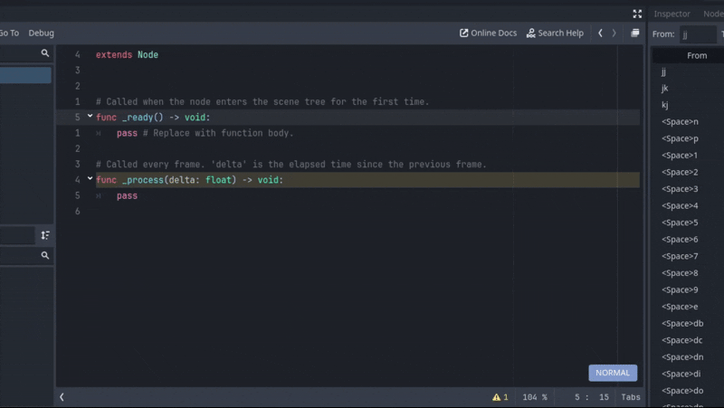

# GodotVim

  

  <b>Vim keybindings for Godot's built-in script editor.</b>

  
  
  

---

## Installation

### 1. Godot Asset Library (Recommended)
The easiest way to install and get updates.

1.  Open your Godot project.
2.  Click the **AssetLib** tab at the top.
3.  Search for **"GodotVim"** or [click here to view on the web](https://godotengine.org/asset-library/asset/4666).
4.  Click **Download**, then **Install**.
5.  Go to **Project → Project Settings → Plugins** and enable **GodotVim**.
6.  **Restart the Editor** (Required for the plugin to fully load).

---

## Features

*   **Full Modal Editing**: Normal, Insert, Visual, Visual Line, Visual Block, and Replace modes.
*   **Command Bar**: Functional Ex-command line for substitutions (`:%s/foo/bar/g`) and more.
*   **Configurable**: Customize your experience (cursor colors, mappings, etc.) via Project Settings.

---

## Godot Interoperability Features

**Dock Navigation (WindowNav)**
Seamlessly switch between docks using `Ctrl+{h,j,k,l}`.
*   **Navigate**: `j`/`k` to move vertically, `h`/`l` to collapse/expand.
*   **Search**: Press `/` to search within the dock.
*   **Actions**: `Enter` to open file, `Esc` to return to editor.

**Visual Configuration**
Customize Vim experience directly in Godot's Project Settings. See [Configuration](#configuration) section for more details.

**Debug Integration**
Set breakpoints and step through code without leaving keyboard control.
You can modify the default mapping to make it easier to use. See [Configuration](#configuration) section for more details.

**Documentation**
*   `gd`: **Lookup Symbol** (Go to Definition).
*   `K`: **Show Documentation** (Show documentation for the symbol under the cursor).

---

## Recommended Mappings

GodotVim includes built-in preset mappings (disabled by default). Enable them in **Project Settings → GodotVim → Mappings**. It will appear on the right side dock right of the History tab.

> [!NOTE]
> Mappings starting with `:` do not need `<CR>` at the end. Use `<Space>e` → `:FileSystem`, not `:FileSystem<CR>`.

*   **Insert Mode Escapes**: `jj`, `jk`, `kj` → `<Esc>`
*   **Leader Mappings** (Space key):
    *   `<Space>1` - `<Space>9` → Switch to tab 1-9
    *   `<Space>e` → Jump to FileSystem
    *   `<Space>db` → Toggle Breakpoint
    *   `<Space>dc` → Continue
    *   `<Space>dn` → Next
    *   `<Space>di` → Step In
    *   `<Space>do` → Step Out
    *   `<Space>dp` → Pause

---

## Configuration

Customize GodotVim in **Project → Project Settings → GodotVim**. Note that **most settings require a restart** to take effect.

*   **General**: Enable/Disable plugin, Set Log Level.
*   **Editor**:
    *   **Scroll Offset**: Lines to keep visible above/below cursor.
    *   **Line Number Mode**: Absolute, Relative, or Hybrid.
    *   **Is Keyword**: Characters considered part of a word (e.g., `@,48-57,_,192-255`).
    *   **Command Line**: Shows current **Mode** and Ex-command bar.
    *   **Key Passthrough**: List of keys to bypass Vim.
*   **Cursor**: Customize colors for Normal, Insert, and Visual modes.
*   **Clipboard**: Toggle auto-copy to system clipboard.
*   **Mapping**: Enable/Disable mappings and set Timeout Length.

---

## Limitations

*   **:w**: Does not sync with Godot editor (external changes not picked up). Please use `Ctrl+S` / `Cmd+S` to save.
*   **:q**: Does not close Godot tabs reliably. Please use `Ctrl+W` / `Cmd+W` to close the current tab.
*   **Floating Window**: Dock navigation doesn't work correctly when the Script Editor is floating (detached).

---

MIT License